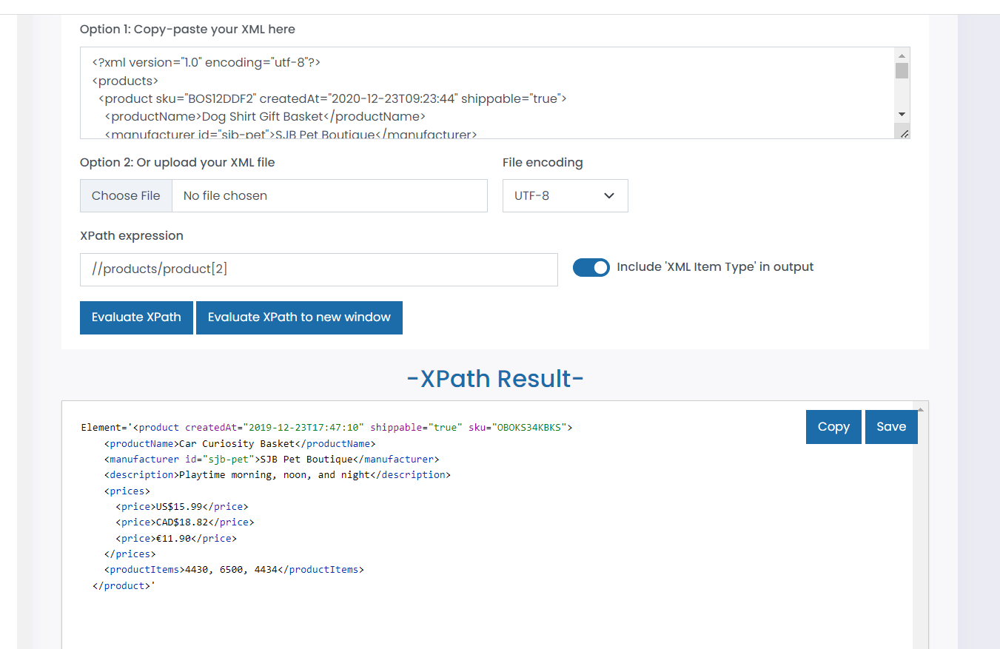
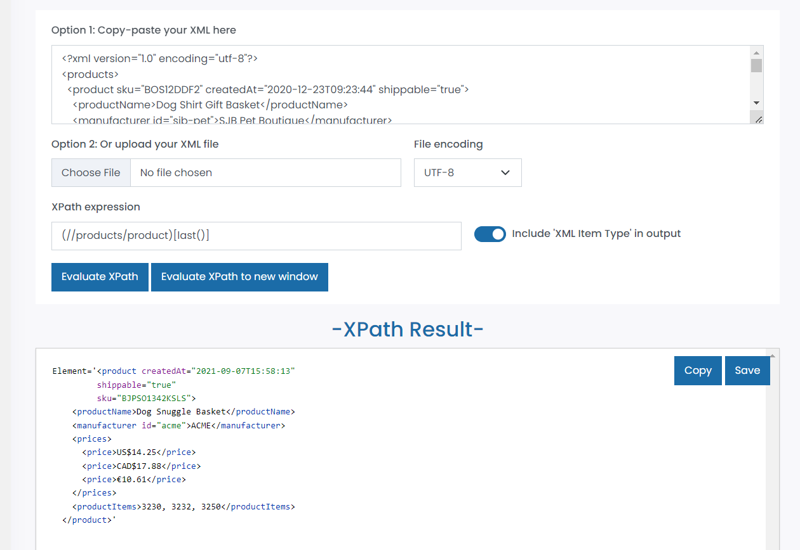
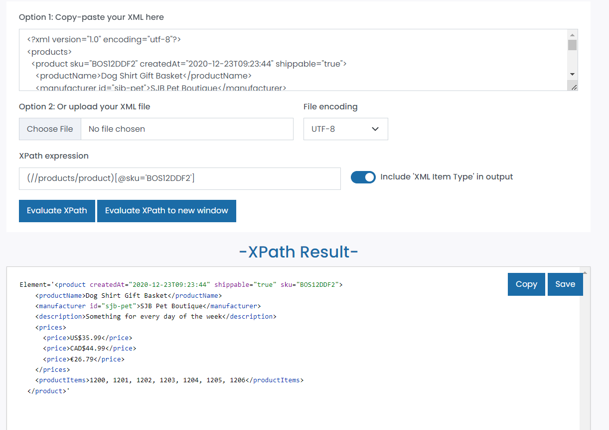
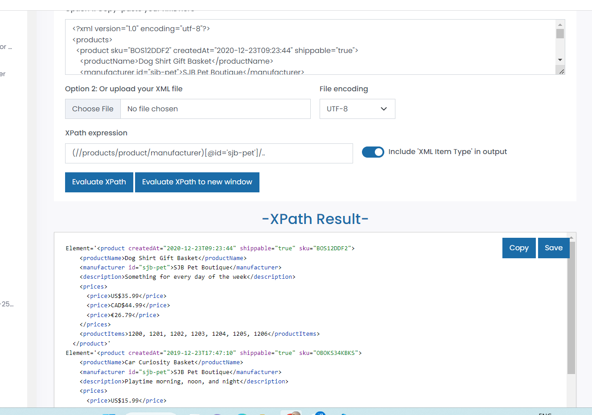

Question 1: //products/product[2]
            

Question 2: (//products/product)[last()]
            

Question 3: (//products/product)[@sku='BOS12DDF2']
            )

Question 4: (//products/product/manufacturer)[@id='sjb-pet']/..
            