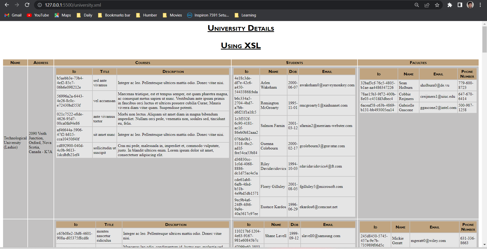

The main objective of this project part-1 was to able create xml from json and then create DTD, XSD, XSLT and HTML to display and structure the given Data of universities and display it in tabular form in the browser to make it more readable. First, we converted data from JSON to XML file to understand and decide the later workflow. The later parts or work i did on this project is as follows:

- I did XSD for the XML file.
  

- I created XSLT for the given XML file and I also did work on CSS file to make the table more visiblly clear to read.
  
