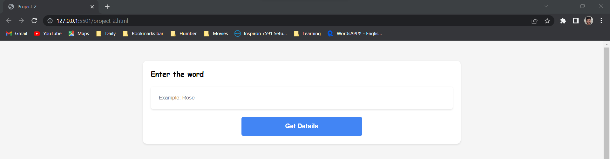
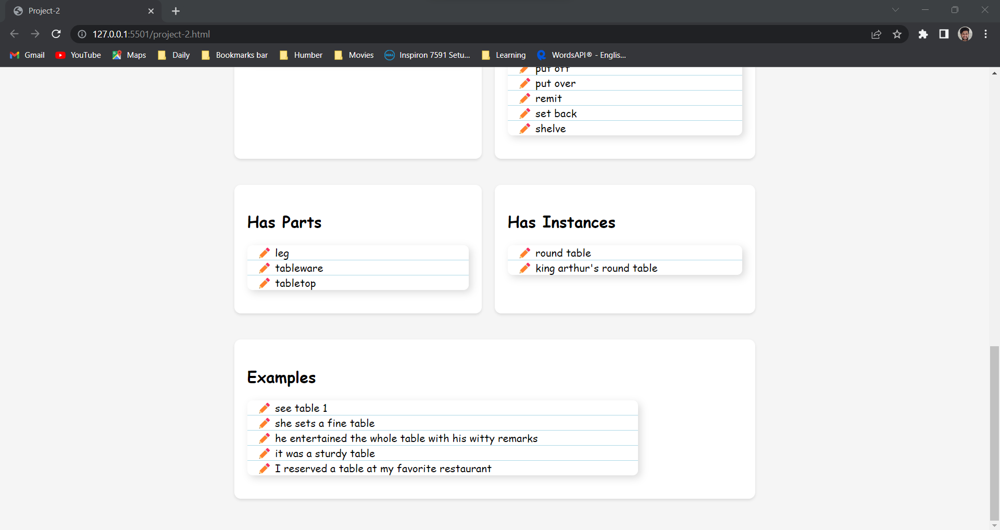

The main objective of this project-2 was to get the data from the API using fetch and other JS learnt in class.
Here, our API was WORDAPI which is a data dictionary for over 10000 words. It contains definitions, synonyms, examples, antonyms, its properties like: has parts, is a memberOF, etc.. So, Here we have succesfully fetched 6 properties:

1.Definitions
2.Rhymes
3.Synonyms
4.Has Parts
5.Has Instances
6.Examples

for the word that user will enter in this given in this search box.

- I fetched the first 3 parts:

  # 4.Has Parts

  # 5.Has Instances

  # 6.Examples

  

- Also, CSS part was done by both of us.
